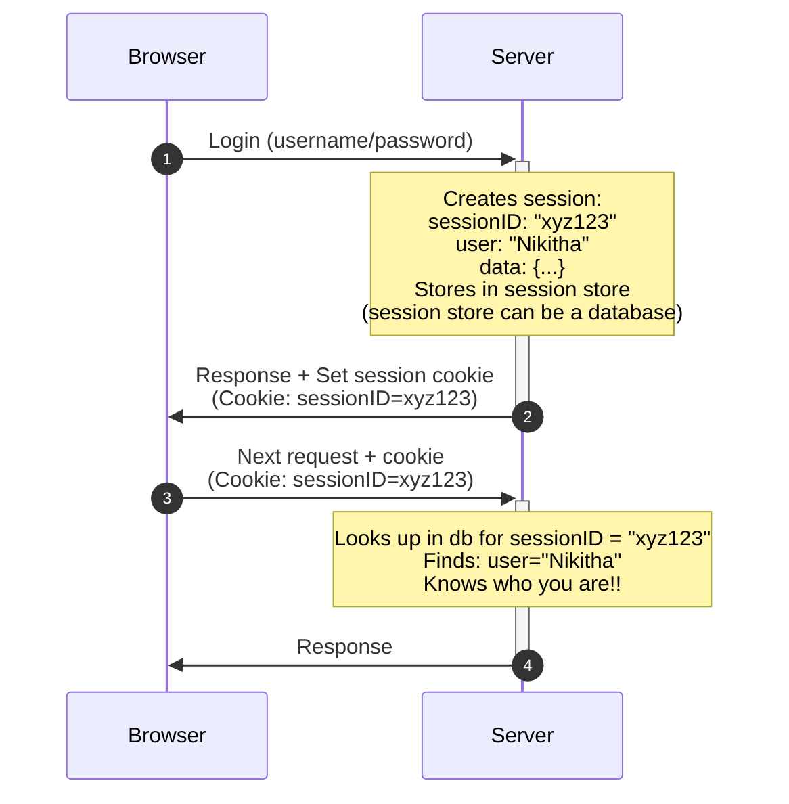

# Authentication and Authorization

| Aspect | Authentication | Authorization |
|---| --- | --- |
| **Why?** |Without knowing **who** users are, the system treats everyone as the same person. Your data, my data, admin data—all accessible to anyone. No privacy, no security, no personal experience. | Without knowing **what** users can do, everyone who logs in has unlimited power. Regular users could delete databases, access confidential files, or perform admin actions. Chaos and security disasters. | 
| **Analogy** | A office with no ID check at the entrance—anyone can claim to be anyone. | Everyone with a office ID card can access every room, including the CEO's office and server room. |
| **Why we need both?** | **Authentication alone** = "I know you're Nikitha, but you have access to every room in the office" (which is insecure) | **Authorization alone** = "You can only use the server room, but I don't know who you are" (which is meaningless) |
| **What?** | Authentication verifies **who** you are.   e.g. Authentication says "you are Nikitha."  | Authorization determines **what** you're allowed to do.   e.g. Authorization says "Nikitha can only view, not delete."|

---

### Session, jwt and Cookies🍪

| Aspect | Session | jwt | Cookies |
| --- | --- | --- | --- |
| **Why?** | **HTTP is stateless**—each request is independent with no memory of previous requests. Without sessions, the server forgets you immediately after responding.   **The major problem:** You'd have to re-authenticate on every single action. Click a button? Login again. Load a new page? Login again. Want to buy another ice cream? Login again.  | **Problem with session:** Server must store and look up session data for every request. This does not scale well across multiple servers or microservices.   **JWT solves the above problem**—using a self contained token which holds everything a server needs. No storage, no lookups, just verify the signature and trust the data. | Cookies were introduced for the same reason as sessions were introduced. To provide HTTP requests some state as they are stateless. | 
| **What?** | Session is a mechanism for the server to remember you across multiple requests.   When you login the server creates a session (a temp record of **"who you are"**) and returns you a **SessionID**. On every subsequent request you send that **SessionID** and the server looks up you session to know its still you.  | A **JWT** is a self contained token that carries user **information inside itself**. Unlike sessions where the server stores the data and gives you just an ID, JWT is the **data—encoded** and **signed** so it cant be altered.    **Structure:** Three parts separated by dots: `header.payload.signature`   **Header:** Token type and algorithm used   **Payload:** User data (username, userID, roles, etc..)   **Signature:** Used to prove the token wasn't modified by anyone| A cookie is a small piece of data the server sends to the browser and asks it to remember. The brower automatically sends it back to the server on future requests to the server, so that the server recognizes you making the HTTP request stateful  |

---
### How does Session, JWT, Cookies work?

**Basic session flow**

> Login → Server creates session & sends ID → Browser stores ID in cookie → Browser auto-sends cookie with requests → Server recognizes you.

**The session problems**

Worked well for **single-server** applications. However, modern systems faced challenges:
- **Cannot scale across multiple servers:** Sessions on server A cannot be accessible to server B
- **Microservices architechture:** Multiple independent servers need to verify users, sharing session across different services is not ideal, every service would need access to the same session store/db
- **Performance issues:** Every request requires a database/cache lookup to validate the session/user, When there are large number of users it leads to high traffic -> many lookups/db hits -> slower response times as, there's only have one sessions database

---

**JWT flow**

1. nikitha (user) logs in -> manoj (server) creates JWT with your info, i sign it with a secret that only we both know, and send back the JWT token
2. nikitha stores the JWT token usually in local storage
3. nikitha makes http request to manoj with JWT token attached in the http header (`Authorization: Bearer oaibqkbqio11kabda`)
4. manoj verifies signature -> Trusts the data inside without needing to look up anything because its sent by nikitha, just kidding. manoj/server verifies the token using the signature (that only we both know) and gets all the information about the user from the JWT token itself so it does not need to look up anything.

**JWT's solution to Session's problem**

**Stateless authentication** - No **server-side storage needed**. The token carries all the necessary information, signed to prevent modifications.

- **Scalable:** Multiple servers can now verify the token independently
- **Distributed:** Works across microservices without needing to access the same database across all the services
- **Cross-domain:** Works seemlessly across APIs, mobile apps etc..
- **Quick:** No db lookups-just signature verification

----

**Cookies🍪**

A cookie is a small piece of data the server sends to the browser, which the browser automatically sends back on future requests to the same site.

- How it works:
  1. Server: "Remember this: userID=123"
  2. Browser stores it
  3. Browser automatically includes it in every future request
  4. Server: "Oh, userID=123, I know you now!"

e.g., 

its 1994. you walk into a bakery for the first time  
"Hi i'd like a chocolate pastry," you say 
The baker smiles, hands you the pastry, and you pay. Nice experience 
Next day, you return. Same bakery, same baker 
"Hi i'd like—" 
"Welcome" the baker interrupts "What can I get you today?" 
You pause. "didn't I come here yesterday..?" 
"Did you?" The baker looks genuinely confused. "I see hundreds of people. Can't remember everyone." 
Every. Single. Day. This happens. 
You become a regular. You come 50 times. Every time, the baker treats you like a stranger. No "good to see you again!" just amnesia. 

Then one day, something changes. 
You walk in. The baker hands you a small card. 
"Here, take this loyalty card. Write your name on it. Bring it every time you visit." 
You write "Nikitha" and pocket the card. 
Next visit, you show the card. 
"Nikitha! Welcome back!" the baker exclaims. "Chocolate pastry again?" 
"You remember!" 
"Of course! Your card tells me who you are. I keep notes about what you like." 

That card? That's a cookie. 

The bakery is the website 
The baker is the server (with amnesia—stateless HTTP) 
The loyalty card is the cookie 
Your name on the card is data (like userID=Nikitha) 
Showing it each visit is your browser automatically sending the cookie with every request 

**The baker (server) can't remember you naturally, so they give you a card (cookie) to remind them who you are each time you visit.**