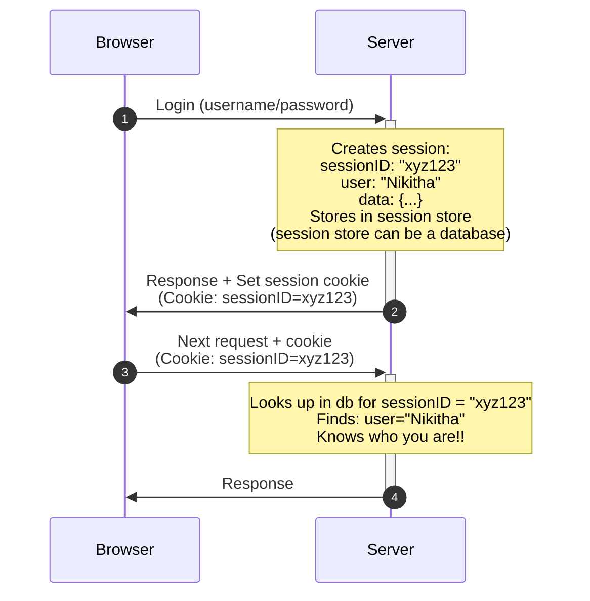

# Authentication and Authorization

| Aspect | Authentication | Authorization |
|---| --- | --- |
| **Why?** |Without knowing **who** users are, the system treats everyone as the same person. Your data, my data, admin data—all accessible to anyone. No privacy, no security, no personal experience. | Without knowing **what** users can do, everyone who logs in has unlimited power. Regular users could delete databases, access confidential files, or perform admin actions. Chaos and security disasters. | 
| **Analogy** | A office with no ID check at the entrance—anyone can claim to be anyone. | Everyone with a office ID card can access every room, including the CEO's office and server room. |
| **Why we need both?** | **Authentication alone** = "I know you're Nikitha, but you have access to every room in the office" (which is insecure) | **Authorization alone** = "You can only use the server room, but I don't know who you are" (which is meaningless) |
| **What?** | Authentication verifies **who** you are.   e.g. Authentication says "you are Nikitha."  | Authorization determines **what** you're allowed to do.   e.g. Authorization says "Nikitha can only view, not delete."|

---

### Session, jwt and Cookies🍪

| Aspect | Session | jwt | Cookies |
| --- | --- | --- | --- |
| **Why?** | **HTTP is stateless**—each request is independent with no memory of previous requests. Without sessions, the server forgets you immediately after responding.   **The major problem:** You'd have to re-authenticate on every single action. Click a button? Login again. Load a new page? Login again. Want to buy another ice cream? Login again.  |  |  | 
| **What?** | Session is a mechanism for the server to remember you across multiple requests.   When you login the server creates a session (a temp record of **"who you are"**) and returns you a **SessionID**. On every subsequent request you send that **SessionID** and the server looks up you session to know its still you.  | | |

**Basic session flow**

