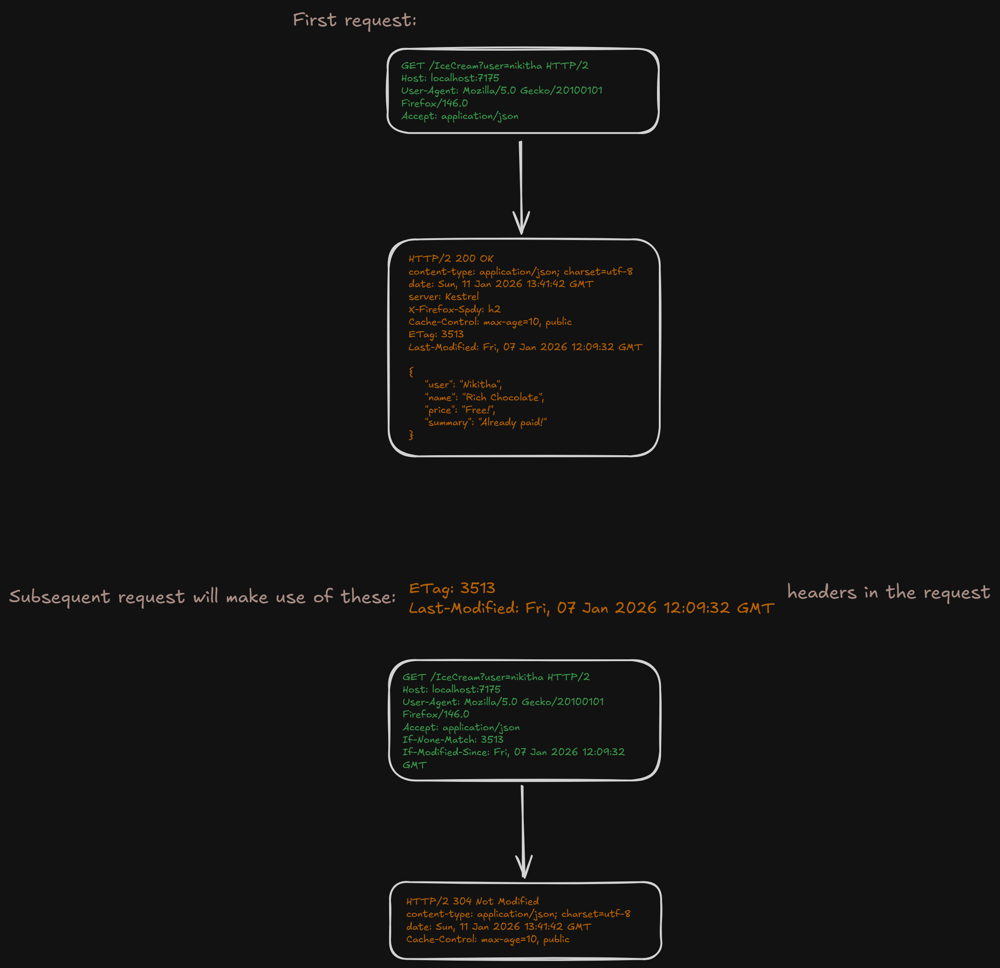

**Why HTTP is needed?**

> HTTP is needed so that communicating systems can understand each other.

---

**What is HTTP? (HyperText Transfer Protocol)**

> HTTP is one of many *application protocols*

#### Key components of application protocol
- **Commands and Responses:** Application protocols define specific commands that a client (e.g. client could be your browser) can send to a server and the corresponding responses the server should provide. For example, HTTP uses commands like GET, POST, and PUT, and a server responds with status codes and data.

- **Data Format and Serialization:** Protocols specify the format in which data should be exchanged. This often involves serialization, where data is converted into a format suitable for transmission. (e.g. a simple form in html would be *converted/serialized* into JSON string *data format* and then transmitted via a http request to a server and the corresponding response is then *converted/de-serialized* into a user-friendly form *data format* that is shown in the web page.)

- **Error Handling:** Robust protocols include mechanisms for error detection and correction, such as checksums or retransmission of data.

- **Session Management:** Some protocols manage sessions to maintain state across multiple interactions.

- **Security:** Secure communication is often a requirement. Protocols like HTTPS use encryption to protect data in transit.

> [!TIP]
>*We will not be going into the rabbit hole of Network ENG.* 
> 
> *For now, all we need to know is that HTTP is an application protocol structure that defines how software applications communicate with each other, typically over a network. HTTP uses TCP (Transmission Control Protocol) to send and recieve the data over a network.*

#### There are two concepts at the heart of HTTP protocols,
- **Stateless** 
  - A HTTP request has no memory of past interaction.
  - Each HTTP request contains all the necessary information to process it, such as headers, URL, HTTP methods etc.. and after the server responds it forgets about everything about the request.
  - When client sends another request the server would treat it as a completly new request.
  - A HTTP request is also self contained request. meaning, everytime you make a request you need to send all the necessary information such as URL, headers, HTTP methods, auth token, cookies etc.. 
  - e.g. for accessing a user profile the client must send auth token, cookies, session details in each request so that the server would know excatly which user is requesting for the data.
  - **Benefits:** 
    - Simplifies server architecture because the server does not need to store the session information.
    - Enables high sclability as HTTP request is self contained the requests can be easily routed across multiple servers because no single server needs to keep track of a single session and if a server crashes the client does not get affected as the server does not maintain any session information that needs to be restored. The client can just make another HTTP request.

- **Client-Server model**
  - In a typical HTTP request-response flow there is always a client and a server.
  - Client can be a web brower, mobile app, postman etc..
  - The server holds the information that needs to retured when requested.
  - Infomation can be a JSON data, HTML document, JS scrips, etc..
  - In a HTTP/HTTPS protocol the process is always initiated by the **client**.
  - The server just sits and waits for the request and just responds with the data that is requested.
  - The client needs to send all the required resources the server needs so that it can process the request such as, the URL, HTTP method, tokens etc..
  - And, HTTP/HTTPS uses TCP protocol to transfer the data.
  > [!TIP]
  > *Client and Server establish some kind of network connection where messages are sent and received.*

#### Messages

**Request Message:**

```http 
GET /IceCream?user=nikitha HTTP/2
Host: localhost:7175
User-Agent: Mozilla/5.0 (Windows NT 10.0; Win64; x64; rv:146.0) Gecko/20100101 Firefox/146.0
Accept: text/html,application/xhtml+xml,application/xml;q=0.9,*/*;q=0.8
Accept-Language: en-GB,en;q=0.5
Accept-Encoding: gzip, deflate, br, zstd
Connection: keep-alive
Upgrade-Insecure-Requests: 1
Sec-Fetch-Dest: document
Sec-Fetch-Mode: navigate
Sec-Fetch-Site: none
Priority: u=0, i
TE: trailers
```

**Response Message:**

```http
HTTP/2 200 
content-type: application/json; charset=utf-8
date: Sun, 11 Jan 2026 13:41:42 GMT
server: Kestrel
X-Firefox-Spdy: h2
```

**Request Headers:** 
> Helps server understand the client's environment, preferences and capablities.

- ***User-Agent:*** Web browser name, OS (Windows/IOS/Linux) etc..
- ***Authorization:*** Bearer token which holds credentials of the user which server uses to authorize the user who is sending the request.
- ***Accept:*** What kind of content the user-agent is capable of processing and preferes to recieve in server's response.

**General Headers:** 
> Used in both req and res headers. They hold some meta about the message.
- ***Date:*** Date of the req/res
- ***Cache-Control:*** no-cache, max-age etc..
- ***Connection:*** Holds meta data about the connection whether it sould closed or not.

**Representation Headers:** 
> Provide information about the body of the request/response of a message.
- ***Content-Type:*** What is the media type used. e.g. JSON, HTML, XML etc..
- ***Content-Length*** The length or the size of the content
- ***Content-Encoding*** Holds information the encoding. e.g. g-zip, specifies that the content is compressed.
- ***ETag*** A unique identifier which is primarily used in caching.
  
**Security Headers:** 
> Used to enhance the security of the request and response by controlling the behavior such as content loading, encryption, cookies etc.. These headers help protect the client and server from various outsite attacks.
- ***Strict-Transport-Security (HSTS):*** Ensures that the messages always use HTTPS preventing protocol downgrade.
- ***Content-Security-Policy:*** Restricts the sources from where the content like JS, CSS etc.. can be loaded preventing cross-site scripting attacks.
***Set-Cookie:*** Prevents JS to access cookies and the cookies are only sent to the server via HTTPS request. To ensure user privacy.

> [!TIP]
> - *HTTP/HPPS Protocol is ***highly extensible*** because Headers can be easily added or customized without altering the underlying protocol. (for e.g. we can add our own custom headers without needing to modify the whole protocol)*
> 
> - *HTTP Headers act as a ***remote control*** on the server side, client can send instructions to the server via headers which influencing the server behavior. e.g. content type negotiation- clients can request for specific type of content formats such as, XML, JSON, etc.. using a *content-type* header and the server would respond with the approriate format. (if the client wants the reponse to be JSON it will send content-type: application/json and the server would respond with json format. Hence making the client to remotly control the server using headers).*

#### HTTP Methods 
> Define the *intent* of the interaction between client and server.
- **GET:** Fetches the resource from the server without modifying the resource.
- **POST:** Creates new resource in the server by sending the resource typically in a request body.
- **PUT:**  Replaces an entire resource, sending the full new version. used where full overwrites is required. PUT is idempotent (multiple identical requests have the same effect)
- **PATCH:** Applies partial updates, sending only the changes. modifies an existing resource and isn't always idempotent. used for efficient, specific field modifications. 
- **DELETE:** Deletes some kind of resource in the server.

#### Idempotent VS Non-Idempotent Request

| Idempotent | Non-Idempotent |
| ----- | ------|
| Does not alter the resource after calling multiple times. <br> e.g. GET, DELETE, PUT <br> e.g. if you call GET http request even a 100 times you would get the same response.| Alters the resources when called. <br> e.g. POST, it creates a new record everytime you make the request. |

#### Options HTTP method 

> A simple HTTP request made by the client to fetch the capabilities of a server for a particular HTTP endpoint. <br>
> Usually used in a preflight HTTP request.

e.g, OPTIONS request from the client,
```http
OPTIONS /api/resource HTTP /2
Host: api.anotherdomain.com
Origin: https://ui.differentdomain.com
Access-Control-Request-Method: PUT
Access-Control-Request-Headers: Authorization
```
- What the above request basically means is that, Hey server (`Host: api.anotherdomain.com`), this is client (`Origin: https://ui.differentdomain.com`) could you please check if this api endpoint (`/api/resource`) in your server supports this (`Access-Control-Request-Method: PUT`) HTTP method and does it also support this (`Access-Control-Request-Headers: Authorization`) header? 

OPTIONS response from the server,
```http
  HTTP/2 204 No Content
  Access-Control-Allow-Origin: https://ui.differentdomain.com
  Access-Control-Allow-Methods: PUT, DELETE
  Access-Control-Allow-Headers: Authorization
  Access-Control-Max-Age: 86400
```
- All the headers are self explainatory and `Access-Control-Max-Age: 86400` just means that the endpoint's *Access-Control-* headers will not change for the next 24 hours.

#### Simple VS Preflight Request

| Simple request | Preflight request |
| ------|------|
|A request is simple when the method is not PUT, DELETE | A request is considered as preflight request when, <br> The method is not POST, GET, HEAD <br> OR <br> The request includes *non-simple* headers (Authorization, X-Custom-Header) <br> OR <br> Content-Type is other than, application/x-www-form-unlencoded, multipart/form-data, text/plain |

- e.g. of simple request
```http 
GET /IceCream?user=nikitha HTTP/2
Host: localhost:7175
User-Agent: Mozilla/5.0 (Windows NT 10.0; Win64; x64; rv:146.0) Gecko/20100101 Firefox/146.0
Accept: text/html,application/xhtml+xml,application/xml;q=0.9,*/*;q=0.8
Accept-Language: en-GB,en;q=0.5
Accept-Encoding: gzip, deflate, br, zstd
Connection: keep-alive
Upgrade-Insecure-Requests: 1
Sec-Fetch-Dest: document
Sec-Fetch-Mode: navigate
Sec-Fetch-Site: none
Priority: u=0, i
TE: trailers
```

- e.g of preflight request
  > Preflight requests happen in 2-stage,
  > 1. Client (browser) makes a OPTIONS request to the server asking for server capabalities for the request endpoint - this is known as the preflight request.
  > 2. Once the preflight request is successful only then the client (browser) makes the actual request to the server.


1. **Preflight request uses OPTIONS method**
  
Request:
```http
OPTIONS /api/resource HTTP /2
Host: api.anotherdomain.com
Origin: https://ui.differentdomain.com
Access-Control-Request-Method: PUT
Access-Control-Request-Headers: Authorization
```
Response:
```http
HTTP/2 204 No Content
Access-Control-Allow-Origin: https://ui.differentdomain.com
Access-Control-Allow-Methods: PUT, DELETE
Access-Control-Allow-Headers: Authorization
Access-Control-Max-Age: 86400
```

2. **Actual PUT request**

Request:
```http
PUT /api/resource HTTP /2
Host: api.anotherdomain.com
Origin: https://ui.differentdomain.com
Authorization: Bearer token123
Content-Type: application/json

{
  "name": "random"
}
```

Response:
```http
HTTP /2 200 OK
Origin: https://ui.differentdomain.com
Access-Control-Allow-Origin: https://ui.differentdomain.com

{
  "message": "resourece updated successfully"
}
```

> [!TIP]
> **But why on earth do we want to do all this preflight, options? why cant we just directly make the actual request?** <br>
> - *We need it for security.* 
> - *Client (Browser) does not want to request a server where its not allowed to make a request.*
> - *Since, the Client (Brower) web page runs on different domain in other words ***origin*** and the server lives in a completly different domain ***host*** *
> - *The origin first needs to check if it is even allowed to make requests the host or not.* 
> - *If its not allowed we get back CORS error in the network tab and also in the console*
> - *And if the origin is allowed to make requests to the host the OPTIONS request will respond with `Access-Control-Allow-Origin: https://ui.differentdomain.com` stating that, ***Cross-Origin-Resources-Sharing(CORS)*** is allowed between Client/Origin and the Server/Host*
> - *CORS configuration is done at the server level.*
> - *Congrats you now know the basic concept of CORS.*

#### HTTP status codes

> HTTP status codes are a global standard way of letting the client know about the request's state from the server.

| Status code series | Description | Example |
| --- | --- | --- |
| `1xx` | [Information](https://www.websitepulse.com/kb/1xx_http_status_codes) | `100 Continue` Request can continue with the next stage <br> e.g. First the client would send the size of the file in the request headers and the server would check the file size and if it is accepted by the server it would respond with 100 Continue meaning, the client can now procced to send the whole data for upload usually using a `POST` request. <br>Other status codes include, <br> `101 Switching Protocols` <br> `102 Processing` <br>etc..|  
| `2xx` | [Success](https://www.websitepulse.com/kb/2xx_http_status_codes) | `200 OK` Request has been successfully processed by the server, commonly used in `GET` requests <br> `201 Created` Resouce requested has been created in the server, this is usually paired with `POST` requests <br> `204 No Content` Request has been processed and it doesnt produce any response, you will find this used in `DELETE` requests <br> `202 Accepted` Request has been accepted for processing but not yet completed, used for large data processing which takes long time to complete |
| `3xx` | [Re-directions](https://www.websitepulse.com/kb/3xx_http_status_codes) | `301 Moved Permanently` Requested request has been permanently moved to a different URL <br> `303 See Other` Used to redirect the client after a `POST` request to a different URL (usually a `GET`) to avoid duplicate form submissions <br> `304 Not Modified` Informs the client that its the cached version of the resource and its still valid to use and its not been modified, helps to reduce the number of requests to the server |
| `4xx` | [Client Errors](https://www.websitepulse.com/kb/4xx_http_status_codes) | `400 Bad Request` Client's request has data validation errors <br> `401 Unauthorized` Client is unauthorized to make the request, e.g missing Authorization headers, invalid jwt token etc.. <br> `403 Forbidden` Server has acknowledged the request but the client is not authorized to access the content, e.g. When user has access to login to the web site but only has access to productA and when user tries to access productB he will be greeted with `403 Forbidden` message <br> `404 Not Found` Server cannot find the request resource/URL <br> `408 Request Timeout` Server did not recieve the complete request within the allowed time period <br> `429 Too Many Requests` Client has made too many requests within a given time frame, usually indicates Rate Limiting is in place at server level <br> `409 Conflict` Requested data is already present in the server, e.g. When client tries to create a new resource with existing name/ID using `POST` or tries to update with the resource which has same name/ID using `PUT` |
|`5xx`| [Server Errors](https://www.websitepulse.com/kb/5xx_http_status_codes) | `500 Interal Server Error` Server has encoutered a unhandeled exception and cannot process the request <br> `503 Service Unavailable` Server is temporarily down and cannot handle the request at this moment, e.g. when the server is undergoing deployment of a newer version of the build, server is under maintainance etc.. |

#### HTTP Caching

> Storing copies of responses for re-use. Reducing network calls, bandwidth, improves load time, reduces server load. <br>
> In other words, re-use the old data if the data has not changed.

- **Response Headers used in HTTP Caching**
  - `Cache-Control`: Specifies the amount of time the client must maintain the response before requesting for a new one. e.g. `Cache-Control: max-age=10, public` this means, the client should use the same response for 10 seconds before requesting a new response
  - `ETag`: A unique hash of the response sent by the server. e.g. `ETag: 23hdaoncox` the hashed value of response: `{"Status": "Error" }` is `23hdaoncox`.
  - `Last-Modified`: The last modified date time of the response. e.g. `Last-Modified: Fri, 07 Jan 2025 12:09:32 GMT` meaning, the resource was last modified at *Fri, 07 Jan 2025 12:09:32 GMT*
  
- **Request Headers used in HTTP Caching**
- `If-None-Match`: Sends the value of `ETag` header which the client had recieved in the first response when the resource was requested. e.g. `If-None-Match: 23hdaoncox` server uses this `ETag` value checks if the hash of the new response is same has the new one, if its the same then server would respond with `304 Not Modified`
- `If-Modified-Since`: Sends the value of `Last-Modified` header which the client had recieved in the first response when the resource was requested. e.g. `If-Modified-Since: Fri, 07 Jan 2026 12:09:32` server sees this header and compares it with the last modified value of the requested resource if both are the same then server would respond with `304 Not Modified` 

**Simple example of *cached* HTTP request flow**


