**Why do we need Backend Server?**

Backend servers centralize data, enforce security, run complex calculations, and enable communication between different users/external applications—things browsers simply cannot do alone.

---

**What is a Backend Server?**

A program running on a computer that listens for incoming requests and sends back responses with the requested information.

Example: A .Net app that receives "get my back balance" request and Backend server securely checks your real balance in the database and sends it to you.

---

**How to develop a Backend Server?**

Simple https request example (ASP.NET Web API running locally):

> [!TIP]
> You can find actual code here: ***./api-example/***

---

**Request Flow Diagram**:

```mermaid
graph TD;
    A[📱 Nikitha types<br>get-my-icecream.com] --> B[🌐 Azure DNS<br>Resolves to 20.123.45.67]
    B --> C[🚦 NSG Security Check<br>Port 443 allowed?]
    C -- ✅ Yes, proceed --> D[🔒 Azure API Management<br>Decrypts HTTPS & Routes]
    D --> E[⚙️.Net Backend<br>Port 3001]
    E --> F[📊 Process Request<br>Get Cost of Rich Chocolate Ice Cream for single scoop]
    F --> G[📤 Response Generated<br>Usually 93.45rs but for Nikitha its been already paid.]
    G --> H[🔒 Azure API Management Encrypts <br>& Sends Back]
    H --> I[🌐 Browser]
    I --> J[📱 Nikitha sees<br> Usually 93.45rs but for Nikitha its already been paid.]
```

